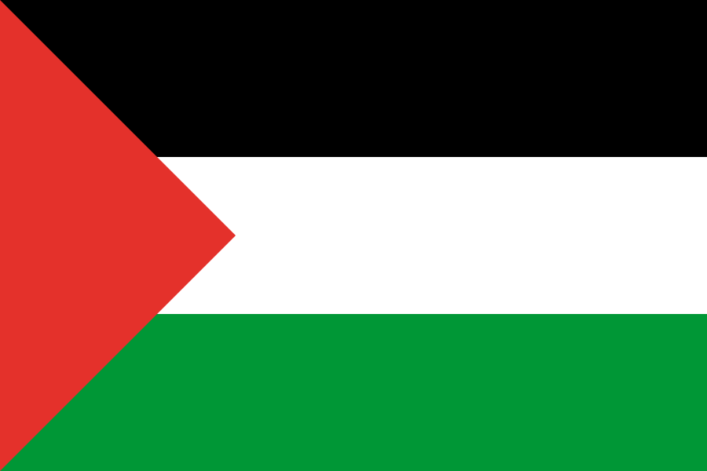
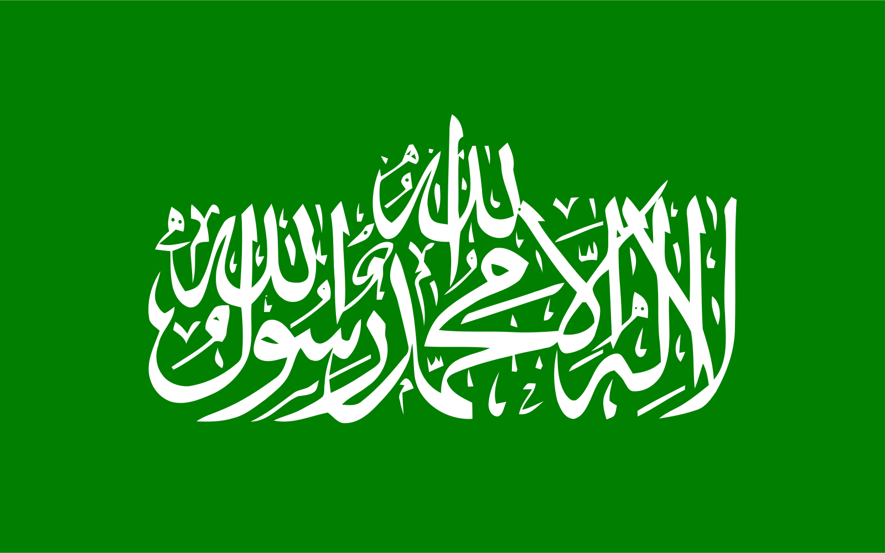

```ascii
██╗███╗   ███╗███╗   ███╗ █████╗ ██████╗  ██████╗ ██╗      █████╗ ██████╗ 
██║████╗ ████║████╗ ████║██╔══██╗██╔══██╗██╔═══██╗██║     ██╔══██╗██╔══██╗
██║██╔████╔██║██╔████╔██║███████║██████╔╝██║   ██║██║     ███████║██████╔╝
██║██║╚██╔╝██║██║╚██╔╝██║██╔══██║██╔═══╝ ██║   ██║██║     ██╔══██║██╔══██╗
██║██║ ╚═╝ ██║██║ ╚═╝ ██║██║  ██║██║     ╚██████╔╝███████╗██║  ██║██║  ██║
╚═╝╚═╝     ╚═╝╚═╝     ╚═╝╚═╝  ╚═╝╚═╝      ╚═════╝ ╚══════╝╚═╝  ╚═╝╚═╝  ╚═╝
```

<div align="center">
  
[](https://git.io/typing-svg)

</div>

## Hey there, It's Polaris!


### About Me

- Passionate about development & exploration
- Specializing in Python tools, Discord and web applications
- Currently diving deep into cybersecurity, obfuscation, and cryptography
- Always coding with purpose, one ASCII at a time!

### Nifty Neural Nexus - NNN?!

<p align="left">
  
  
  
</p>

### Current Focus

```python
current_goals = {
    "learning": ["cybersecurity", "cryptography", "obfuscation"],
    "building": ["web applications", "Python naughty tools", "Lua code obfuscation"],
    "mastering": ["ASCII art 😉"]
}
```

### Contact

<p align="left">
  <a href="https://discord.com/users/odmj">
    
  </a>
    <a href="https://tiktok.com/@bam7">
    
  </a>
  <a href="https://instagram.com/bam2">
    
  </a>
</p>

### A Narcissist?

> I always create the ASCII banner before the code.
> No, I'm not a narcissist... I just appreciate good ASCII art! 😎

---

<div align="left">
  
</div>


<div align="left">
  
  
</div>
